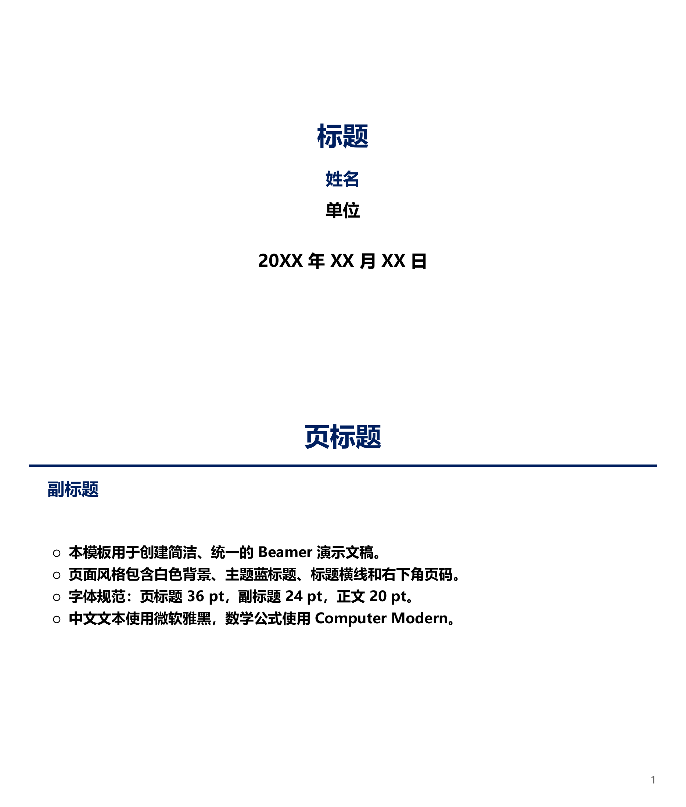

# Tao Slides

This repository contains matching Beamer, PowerPoint, and HTML slide templates.

- `powerpoint/slides.pptx` is the PowerPoint template. Generated master variants are not maintained.
- `beamer/` is the LaTeX Beamer template rebuilt to match the PowerPoint visual system.
- `html/report-template.html` is a browser-playable HTML report template that follows the Beamer style.
- All templates use the same minimal visual language: white background, navy titles, a single title rule, sparse bullets, and bottom-right page numbers.
- PowerPoint text fonts are set to **Microsoft YaHei**.
- Beamer and HTML use **Microsoft YaHei** when available, with compile-safe fallbacks.

## Preview

[Open the Chinese Beamer PDF](beamer/slides_chinese.pdf)



## Slide Spec

- Page size: `33.867 cm x 19.05 cm`.
- HTML presentation canvas: `1280 px x 720 px` for screen playback; print/PDF keeps the Beamer page size.
- Page title: `36 pt`.
- Title rule: `3 pt`.
- Subtitle: `24 pt`.
- Body text: `20 pt`.
- Body content margins align with the subtitle left and right boundaries.
- Tables: navy header text, `1.5 pt` navy header rule, and light gray row rules.

## Structure

```text
beamer/
├── slides.tex                 # English Beamer starter
├── slides_chinese.tex         # Chinese Beamer starter
├── Makefile                   # Build system
└── styles/
    ├── beamerthemetao.sty     # Tao Beamer theme
    ├── loadslides.tex         # English package/font setup
    └── loadslides_chinese.tex # Chinese package/font setup

powerpoint/
└── slides.pptx                # PowerPoint template

html/
└── report-template.html       # Browser-playable HTML report template
```

## Building Beamer

The Beamer template builds with XeLaTeX.

```bash
cd beamer
make      # English version
make cn   # Chinese version
make clean
```

## Using HTML Presentation

Open `html/report-template.html` in a browser. The HTML template runs as a local presentation without a build step.

- `Right Arrow`, `Space`, or `PageDown`: next slide.
- `Left Arrow`, `Backspace`, or `PageUp`: previous slide.
- `Home` / `End`: first or last slide.
- `F`: enter or exit browser fullscreen.
- `Ctrl + P`: print or export all slides to PDF.

The screen presentation uses an exact `16:9` canvas (`1280 px x 720 px`) for stable browser fullscreen behavior. Print output uses the Beamer page size (`33.867 cm x 19.05 cm`).

## Fonts

For best cross-format consistency, the Chinese Beamer template uses the Windows Microsoft YaHei font directly when it is available at `/mnt/c/Windows/Fonts/msyh.ttc`. You can also install it into fontconfig manually:

```bash
mkdir -p ~/.local/share/fonts
cp /mnt/c/Windows/Fonts/msyh*.ttc ~/.local/share/fonts/
fc-cache -f ~/.local/share/fonts/
```

If Microsoft YaHei is unavailable, the English Beamer template falls back to TeX Gyre Heros, and the Chinese template falls back to SimSun.
